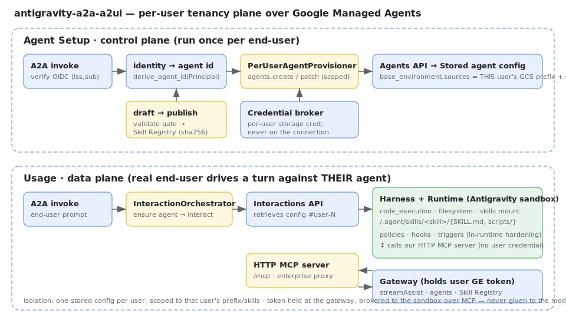

# antigravity-a2a-a2ui

A **shared, stateless control plane** that gives every Gemini Enterprise user a
**private, per-user Antigravity skill workspace** — wrapping Google's **Managed
Agents** (the Agents API + Interactions API) and supplying the one thing the
platform does not: **per-end-user tenancy and isolation**, without ever giving
the shared service broad access to any user's data.

> Tenant isolation is derived from a **verified OAuth `(issuer, subject)`** and
> enforced by **per-user storage scope + one managed agent per user** — not by a
> shared runtime identity, an email from a prompt, or a GCS FUSE mount.

---

## Why this exists

Google Managed Agents run the Antigravity harness in a managed sandbox. But a
stored agent config is a **"reusable agent config"** — the Interactions turn
carries *no* per-user identity or scope; everything lives on the agent resource,
pinned at create time. So **one config is shared across all callers.**

Per-user isolation therefore requires **one managed agent per user**, each scoped
to that user's GCS prefix and skills. Provisioning those agents, mapping identity
to agent, gating skill publication, and brokering credentials **is this control
plane**. The platform supplies the runtime; we supply the tenancy.

See [`docs/adr/0001-repurpose-onto-interactions-api.md`](docs/adr/0001-repurpose-onto-interactions-api.md)
for the full build-vs-buy analysis and the keep/repoint/retire map.

## How it works



The system mirrors the platform's own two planes:

```
AGENT SETUP  (control plane — once per end-user)
  A2A invoke ─► verify (iss,sub) ─► derive_agent_id ─► PerUserAgentProvisioner
                                                          │  agents.create / patch
                                                          ▼
                                       Stored config #user-N  (sources = user's
                                       GCS prefix + Skill Registry skills)

USAGE  (data plane — end-user drives a turn)
  A2A invoke ─► InteractionOrchestrator ─► Interactions API ─► Antigravity sandbox
                                              retrieves config #user-N   │
                                                                         │ MCP (no cred)
                                                                         ▼
                                          HTTP MCP server ─► Gateway (holds user token)
                                                              streamAssist · agents · skills
```

Concepts map one-to-one onto the platform:

| This project | Native equivalent |
| --- | --- |
| Per-user **Workspace** | a per-user **Agent** (`agents/{user-agent-id}`) |
| Immutable **Revision** | a **Skill + SkillRevision** (native `sha256`) |
| **Activate generation** | `agents.patch` the `skill_registry` source |
| **Session / conversation** | an **Interaction** (`interactions.create`) |
| Materialized skills dir | the sandbox `/.agent/skills/...` mount (native, our format) |

## Security model

Two identity planes are kept apart in code so they cannot be conflated:

* **agentAuthorization** → verified `Principal{issuer, subject}` → agent id.
* **toolAuthorization** → opaque `ToolCredential`, handed only to the storage
  broker, **never** to the model, the connection, or the sandbox.

The user's Gemini Enterprise token is held at the **gateway**. The sandbox agent
reaches connectors / other agents / skills only through a **credential-free HTTP
MCP server**, authorized by a short-lived **session proxy token** — so a token
the model can see is never a token it can exfiltrate.

**In-runtime hardening** (Antigravity SDK `policies` / `hooks` / `triggers`,
verified against `google-antigravity 0.1.4` — see
[`docs/adr/0002-...`](docs/adr/0002-antigravity-sdk-advanced-capabilities.md)):

| Capability | Use |
| --- | --- |
| `policy.workspace_only(dir)` | confine file tools to the user's session tree |
| `policy.deny("run_command", when=is_credential_exfil)` | block `gcloud auth print-access-token`, metadata-server, `tokeninfo`, ADC reads |
| `hooks` (`on_session_*`, `post_tool_call`, `on_tool_error`) | structured audit + secret redaction |
| `triggers` (`every`, `on_file_change`) | scheduled / react-to-upload skills |
| `CapabilitiesConfig(disabled_tools=[RUN_COMMAND])` | least-privilege tool surface for skill-only agents |

## Install & test (local)

```bash
python3 -m venv .venv && . .venv/bin/activate
pip install -e '.[dev]'
pytest                              # 144 tests: isolation, integrity, lifecycle, platform client, hardening, agents-cli

# Run the gateway locally (dev identity + local-filesystem "bucket")
export A2A_ALLOW_INSECURE_DEV=true
export A2A_STORAGE_LOCAL_ROOT=/tmp/a2a-bucket
python -m a2a_workspace               # serves on :8080
```

Optional extras: `.[gcp]` (Cloud Storage + Firestore), `.[antigravity]`
(`google-antigravity` + `google-genai`), `.[adk]` (ADK + a2a-sdk for the
agents-cli workflow).

## Deploy to Gemini Enterprise with agents-cli

This repo is an [agents-cli](https://github.com/google/agents-cli) project: the
root [`agents-cli-manifest.yaml`](agents-cli-manifest.yaml) declares it
(`language: python`, `agent_directory: app`, `deployment_target: cloud_run`,
`is_a2a: true`), and [`app/agent.py`](app/agent.py) exposes an ADK `root_agent`
wired to the same credential-free enterprise tools.

```bash
# 0. Install the CLI and authenticate
uv tool install google-agents-cli
agents-cli login
agents-cli info                       # reads agents-cli-manifest.yaml

# 1. Configure the gateway for your Gemini Enterprise app
export A2A_GE_PROJECT=my-project A2A_GE_ENGINE=my-app-id   # location defaults to "global"
export A2A_PUBLIC_URL=https://my-gateway.run.app
export A2A_SESSION_TOKEN_SECRET=$(openssl rand -hex 32)

# 2. Deploy the control-plane gateway (serves the A2A agent card)
agents-cli deploy                     # → Cloud Run (or: gcloud run deploy)

# 3. Grant the Discovery Engine SA permission to invoke the Cloud Run service
gcloud run services add-iam-policy-binding my-gateway \
  --member="serviceAccount:service-<PROJECT_NUMBER>@gcp-sa-discoveryengine.iam.gserviceaccount.com" \
  --role="roles/run.servicesInvoker" --region=<REGION>

# 4. Register the agent into your Gemini Enterprise app (fetches our A2A card)
agents-cli publish gemini-enterprise \
  --registration-type a2a \
  --agent-card-url https://my-gateway.run.app/a2a/app/.well-known/agent-card.json \
  --gemini-enterprise-app-id projects/<n>/locations/global/collections/default_collection/engines/my-app-id \
  --display-name "Antigravity Skill Assistant"
```

The gateway serves the A2A card at both `/.well-known/agent.json` (native) and
`/a2a/app/.well-known/agent-card.json` (agents-cli/A2A schema). The exact publish
argv is generated by `a2a_workspace.integrations.agents_cli.build_publish_command`.

**Two runtimes, one app.** ADK agents built with agents-cli deploy to Agent
Runtime / Cloud Run as reasoning engines; our **per-user managed agents** use the
Antigravity sandbox via the Agents API. Both register into the same Gemini
Enterprise app and both consume our enterprise MCP tools + skills. Full walkthrough:
[`docs/agents-cli-integration.md`](docs/agents-cli-integration.md).

## Verify against a live tenant

We could not determine from Google's docs **what identity the sandbox runtime
uses to read its mounted sources** — and that decides whether per-user IAM is
*enforced* isolation or whether the storage guard remains the real boundary. The
[`experiments/`](experiments) harness settles this (and four related questions)
against your own project with one interactive command:

```bash
cd experiments
gcloud auth application-default login
make setup        # configure → install → doctor → seed → run → report
```

It provisions throwaway `probe-*` agents, runs five investigations (sandbox
identity, per-agent vs shared SA, cross-tenant reach, which `agents.create`
hardening controls are honored, `/mcp` reachability), classifies each outcome,
cleans up, and writes a single `results/report-*.md`. Every status maps to a
concrete next action in [`experiments/README.md`](experiments/README.md); the
lower-level one-off probes live in [`scripts/`](scripts) and the operator
walkthrough in [`docs/managed-agents-runbook.md`](docs/managed-agents-runbook.md).

## HTTP surface

| Method & path | Purpose |
| --- | --- |
| `GET /.well-known/agent.json` | Native A2A agent card (two auth planes) |
| `GET /a2a/app/.well-known/agent-card.json` | agents-cli / A2A-schema card |
| `POST /a2a/invoke` | Provision + start a pinned conversation for the verified principal |
| `POST /mcp/tools/list` · `/mcp/tools/call` | Credential-free enterprise tools for the sandbox (session-token authed) |
| `POST /workspaces/me/drafts` … `/validate` `/submit` `/publish` | Bounded skill publish pipeline |
| `POST /enterprise/assist` · `/agents/*` · `/skill` · `/skills/find` | Gateway-brokered Discovery Engine calls |
| `POST /workspaces/me/skills/registry-push` · `registry-import` · `import-zip` | Skill Registry round-trip (agentskills.io ZIP) |

Every `/workspaces/me` route resolves the workspace from the **verified
principal** — never a path parameter — so a caller can only act on their own.

## Configuration

All via environment (see `src/a2a_workspace/config.py`). Key switches:

| Variable | Default | Notes |
| --- | --- | --- |
| `A2A_IDENTITY_BACKEND` | `dev` | `jwt` for production (`A2A_OIDC_ISSUER/AUDIENCE/JWKS_URI`) |
| `A2A_ALLOW_INSECURE_DEV` | `false` | must be `true` to enable the dev verifier |
| `A2A_STORAGE_BACKEND` | `local` | `gcs` requires the `gcp` extra |
| `A2A_REGISTRY_BACKEND` | `memory` | `firestore` requires the `gcp` extra |
| `A2A_GE_PROJECT` / `A2A_GE_ENGINE` | — | the target Gemini Enterprise app |
| `A2A_PUBLIC_URL` | `http://localhost:8080` | the gateway's externally reachable URL |

## Layout

```
src/a2a_workspace/
  identity/           two planes: Principal, verifiers, opaque ToolCredential, session tokens
  registry/           workspace/revision/generation models + bounded draft→publish pipeline
  storage/            trusted StorageAdapter (local + GCS), workspace key layout & guards
  broker/             credential broker: delegated OAuth or CAB-downscoped credentials
  provisioning/       first-touch workspace IAM  +  PerUserAgentProvisioner (agents.create/patch)
  session/            generation-pinned conversations  +  InteractionOrchestrator
  gemini_enterprise/  Discovery Engine + Skill Registry + Agent Platform clients + proxy tools
  antigravity/        SDK wiring: advanced config, hooks, policies, triggers, exfil hardening
  integrations/       agents-cli: manifest, A2A card adapter, publish-command builder
  gateway/            FastAPI app: A2A card, workspace REST, enterprise proxy, MCP server, agents-cli compat
  container.py        composition root (the only place concrete backends are named)
app/                  ADK root_agent for the agents-cli workflow
scripts/              live-tenant probes (sandbox identity, provision + interact)
docs/                 architecture, ADRs, agents-cli integration, runbook
```

## Docs

- [`docs/architecture.md`](docs/architecture.md) — isolation design and rationale
- [`docs/adr/0001-...`](docs/adr/0001-repurpose-onto-interactions-api.md) — Managed Agents build-vs-buy + repurpose map
- [`docs/adr/0002-...`](docs/adr/0002-antigravity-sdk-advanced-capabilities.md) — hooks / policies / triggers
- [`docs/agents-cli-integration.md`](docs/agents-cli-integration.md) — deploy & publish via agents-cli
- [`docs/managed-agents-runbook.md`](docs/managed-agents-runbook.md) — verify against a live tenant

## License

Apache-2.0. See [LICENSE](LICENSE).
